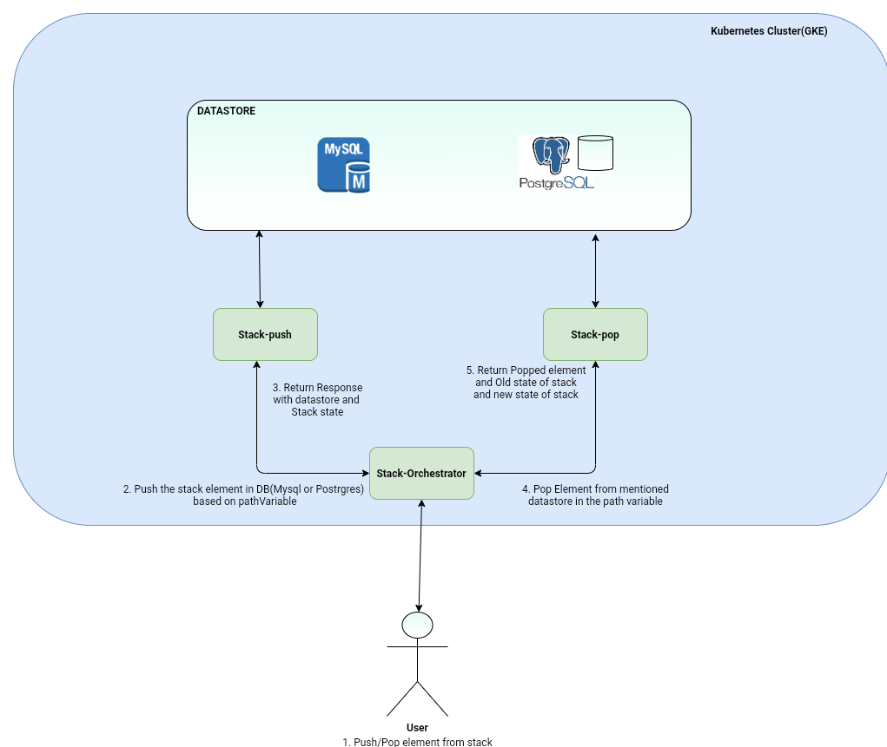

# stack-orchestrator

To demonstrate microservice architecture stack push and pop operation is divided in following microservice:
 * <b>Stack-push:</b> Push the element in stack, stack element will be persisted in mysql or postgres db based on the path variable provided in URL
 * <b>Stack-pop:</b> Pop the last element inserted in db. DB name is provieded in URL path variable.
 * <b>Stack-orchestrator:</b> Interface for push and pop service. Client will interact with orchestrator endpoint only. Orchestrator will call push or pop service.
 
 Communication between micro-services are based on REST api calls.
 
 <b>Swagger Spec:</b> [swagger-spec.yaml](https://github.com/Himanshu-Kushwaha/stack-orchestrator/blob/main/swagger-spec.yaml)
 
 <b>Docker Compose Test:</b> [docker-compose-test.yaml](https://github.com/Himanshu-Kushwaha/stack-orchestrator/blob/main/docker-compose-test.yaml)
 
 <b>CI: Github Action</b> is used to build the service and run the test cases. 
 A multistage Dockerfile created to build each service and then create a docker image. Docker images are pushed to docker hub registry [himanshu007](https://hub.docker.com/repositories/himanshu007). To deploy the services along with Databases [these template](https://github.com/Himanshu-Kushwaha/stack-pop/tree/main/deployment) files are used.
 
 
 Services are deployed in Google-cloud GKE(Google Kubernetes Engine):
 | <b>Service</b>  | <b>Repo</b>  | <b>DockerHub Repo</b>  | <b>Docker Image</b> |  <b>Deployment Template</b> |
|---|---|---|---|---|
| Stack-push  | [stack-push](https://github.com/Himanshu-Kushwaha/stack-push)  |  [himanshu007/stack-push](https://hub.docker.com/repository/docker/himanshu007/stack-push) | himanshu007/stack-push:main  |  [stack-push.yaml](https://github.com/Himanshu-Kushwaha/stack-pop/blob/main/deployment/stack-push.yaml) |
|  Stack-pop | [stack-pop](https://github.com/Himanshu-Kushwaha/stack-pop)  | [himanshu007/stack-pop](https://hub.docker.com/repository/docker/himanshu007/stack-pop)  |  himanshu007/stack-pop:main |  [stack-pop.yaml](https://github.com/Himanshu-Kushwaha/stack-pop/blob/main/deployment/stack-pop.yaml) |
| Stack-orchestrator  | [stack-orchestrator](https://github.com/Himanshu-Kushwaha/stack-orchestrator)  | [himanshu007/orchestrator](https://hub.docker.com/repository/docker/himanshu007/orchestrator)  |  himanshu007/orchestrator:main |  [orchestrator-deployment.yaml](https://github.com/Himanshu-Kushwaha/stack-pop/blob/main/deployment/orchestrator-deployment.yaml) |
|  Mysql |   |   |  mysql:5.7 | [mysql-deployment.yaml](https://github.com/Himanshu-Kushwaha/stack-pop/blob/main/deployment/mysql-deployment.yaml)  |
|  Postgres |   |   |  postgres:13-alpine | [postgres-deployment.yaml](https://github.com/Himanshu-Kushwaha/stack-pop/blob/main/deployment/postgres-deployment.yaml)  |
